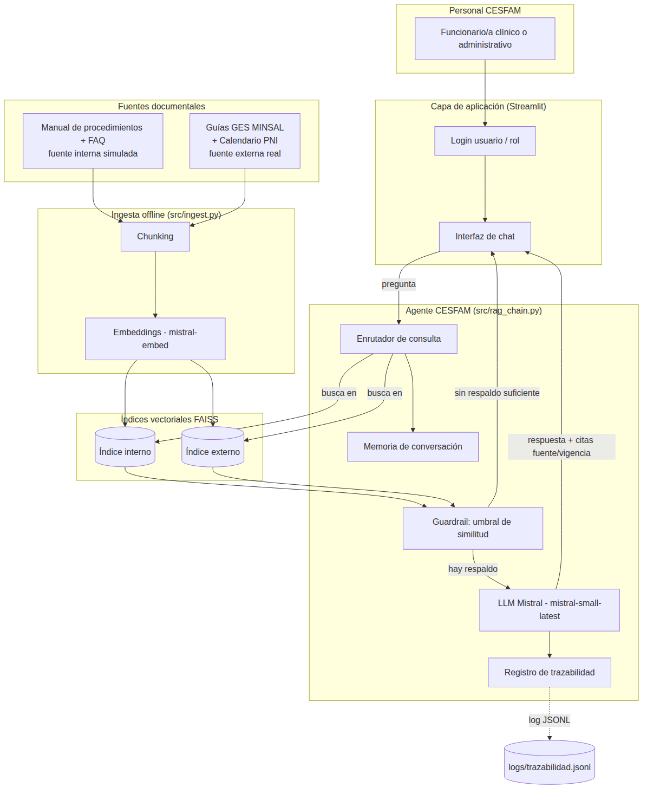

# Arquitectura de la solución (IE4 / IE7)

Fuente editable del diagrama: `arquitectura.mmd` (formato Mermaid, se
puede abrir/editar en https://mermaid.live).

## Componentes y su integración

**1. Capa de aplicación (Streamlit — `app.py`)**
Login por usuario/rol (cumple el requerimiento de acceso restringido de
la propuesta) e interfaz de chat. Es la única puerta de entrada: sin
sesión autenticada no se puede consultar al agente.

**2. Agente CESFAM (`src/rag_chain.py`)**
Es el orquestador central, no un RAG simple:
- *Enrutador de consulta*: decide si buscar en el índice interno, el
  externo, o ambos, según el tipo de pregunta.
- *Memoria de conversación*: arrastra los últimos turnos de la sesión
  para resolver preguntas de seguimiento con contexto.
- *Guardrail de similitud*: compara la distancia del chunk más relevante
  contra un umbral (`SIMILARITY_THRESHOLD`); si ningún chunk recuperado
  es suficientemente similar, el agente rehúsa responder en vez de
  invocar al LLM — resguardo anti-alucinación adicional a la instrucción
  del prompt de sistema.
- *Registro de trazabilidad*: cada intercambio (usuario, pregunta,
  fuentes usadas, respuesta) se guarda en `logs/trazabilidad.jsonl`,
  evidencia de que el 100% de las respuestas quedan con fuente y fecha
  de vigencia asociadas, y sirve como evidencia de pruebas para el repo.

**3. Índices vectoriales FAISS**
Dos índices separados (interno / externo) en vez de uno solo, para que el
enrutador pueda decidir a cuál acudir según el contexto organizacional
definido en la propuesta (fuentes internas simuladas vs. guías MINSAL
reales).

**4. Ingesta offline (`src/ingest.py`)**
Proceso batch, separado de la conversación en tiempo real: carga los
documentos fuente, los divide en chunks (`RecursiveCharacterTextSplitter`)
y genera sus embeddings con `mistral-embed`, guardando cada índice FAISS
en disco. Se ejecuta cada vez que se actualiza la base documental,
cumpliendo el requerimiento de la propuesta de que "la base de
conocimiento debe poder actualizarse y no operar con una copia estática
indefinida".

**5. Fuentes documentales (`data/`)**
Separadas físicamente en `internal/` (manual de procedimientos y FAQ,
simulados) y `external/` (guías GES MINSAL y calendario PNI, con
contenido real transcrito de fuentes oficiales), cada una con metadata de
fuente y fecha de vigencia en el encabezado del archivo.

**6. LLM (Mistral, vía API compatible con OpenAI)**
Genera la respuesta final **solo** cuando el guardrail confirma que hay
contexto suficiente, usando `mistral-small-latest` con temperatura baja
(0.1) para favorecer respuestas consistentes y ceñidas al contexto por
sobre la creatividad.

## Decisiones de diseño relevantes para la defensa (IE8)

- **Dos índices en vez de uno con metadata-filter**: se optó por índices
  separados para que el costo de una consulta mal enrutada sea acotado
  (buscar en ambos, no fallar), y para poder razonar y mostrar en la
  demo, de forma simple, a qué fuente se acudió.
- **Guardrail programático + instrucción de prompt**: se duplica la
  defensa contra alucinaciones (código + prompt) porque, en un dominio
  clínico, depender solo de que el LLM "decida" no responder es
  insuficiente para el objetivo de la propuesta de evitarlas.
- **Sin almacenamiento de datos de pacientes**: la arquitectura no tiene
  ningún componente de captura o persistencia de identificadores de
  pacientes; el propio prompt de sistema lo prohíbe explícitamente. Esto
  responde directamente a la restricción de la Ley N.º 20.584 y N.º
  19.628 declarada en la propuesta.
